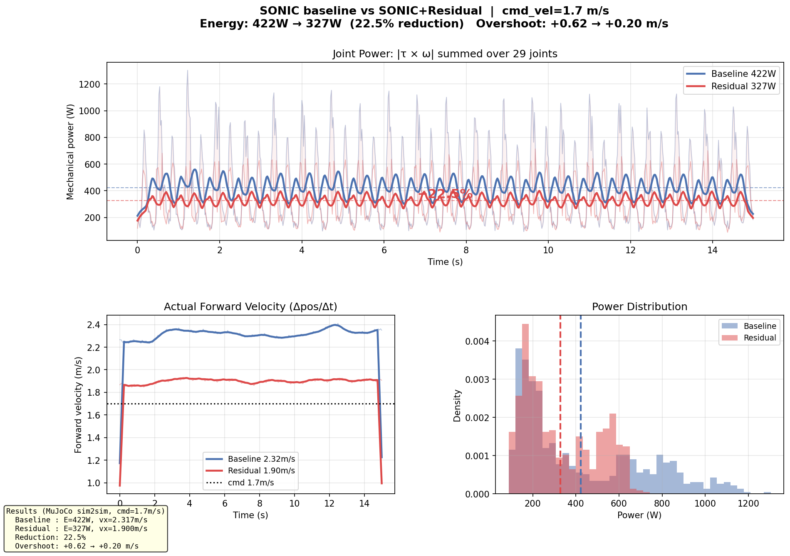
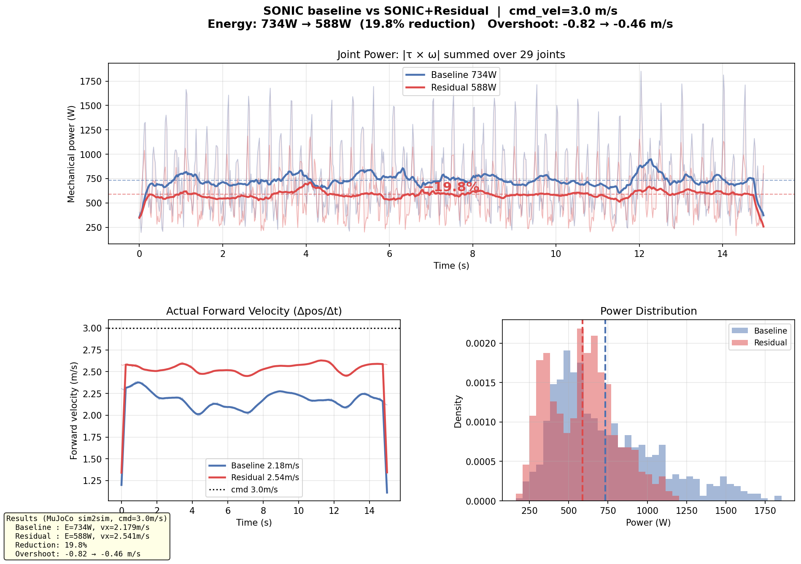

# SONIC × robo_residual — Energy-Efficient Gait

Train a small residual MLP on top of NVIDIA's frozen [SONIC](https://github.com/NVlabs/GR00T-WholeBodyControl) decoder to reduce energy consumption and improve velocity tracking on the Unitree G1 (29 DOF) — without touching the base policy.

> **The idea:** residual ≤ 0.35 rad per leg joint on top of the frozen SONIC base. Like LoRA, but for locomotion.

---

## What it does

| | cmd = 1.7 m/s | cmd = 3.0 m/s |
|---|---|---|
| Energy reduction | **−22.5%** (422 W → 327 W) | **−19.8%** (734 W → 588 W) |
| Velocity tracking error | −67% | −47% |
| Gait smoothness σ(vx) | −52% | −31% |

At 3.0 m/s the residual finds a **Pareto improvement — faster AND more efficient**. The base policy had headroom it wasn't using.

### Side-by-side comparison

| 1.7 m/s | 3.0 m/s |
|---|---|
|  |  |
|  |  |

---

## How it works

```
  target_vel ──► planner ──► encoder ──► 64-D token ─────────────────┐
                                                                      │
  994-D proprio history ──────────────────────────────────────────────┼──► decoder.onnx  (FROZEN)
                                                                      │         │
                                         994-D obs ──► residual MLP ─┼─────────┤  base + clamp(δ, −lim, +lim)
                                                       TRAINABLE      │         │
                                                       zero-init       └─────────▼
                                                                        29 joint targets
```

After training, `fuse.py` merges decoder + residual into a **single drop-in ONNX**. The deploy stack is unchanged.

### Per-joint residual budget

| Group | Max residual |
|-------|-------------|
| Legs (hip, knee, ankle) | 0.35 rad |
| Waist | 0.10 rad |
| Arms | 0.03 rad |

---

## Quickstart

### 1. Get SONIC models

```bash
pip install huggingface_hub
python download_models.py
```

This downloads `model_decoder.onnx`, `model_encoder_dyn.onnx`, `planner_sonic_dyn.onnx` and `observation_config.yaml` from [`nvidia/GEAR-SONIC`](https://huggingface.co/nvidia/GEAR-SONIC) into `models/`.

### 2. Record a reference dataset (IsaacLab)

```bash
conda activate robo
export OMNI_KIT_ACCEPT_EULA=yes PYTHONUNBUFFERED=1

python -u examples/sonic_energy_efficient/tools/generate_reference_dataset.py \
  --decoder-onnx examples/sonic_energy_efficient/models/model_decoder.onnx \
  --planner-onnx examples/sonic_energy_efficient/models/planner_sonic_dyn.onnx \
  --encoder-onnx examples/sonic_energy_efficient/models/model_encoder_dyn.onnx \
  --output examples/sonic_energy_efficient/models/dataset_3p0_isaaclab.npz \
  --duration 300 --cmd-buckets 3.0
# Sanity check: vx_mean should be ≈ 2.7 m/s at cmd=3.0
# Repeat with --cmd-buckets 1.7 for dataset_1p7_isaaclab.npz
```

### 3. Train (never run both speeds in parallel — will OOM)

```bash
python -u examples/sonic_energy_efficient/train_isaac.py \
  --decoder-onnx examples/sonic_energy_efficient/models/model_decoder.onnx \
  --reference-dataset examples/sonic_energy_efficient/models/dataset_3p0_isaaclab.npz \
  --num-envs 1024 --iterations 2000 \
  --output-dir runs/sonic_energy_3p0_v9
# Best checkpoint typically at iter ~1000. Training diverges after ~1500 — that's expected.
```

### 4. Fuse into a deployable ONNX

```bash
python examples/sonic_energy_efficient/fuse.py \
  --decoder-onnx examples/sonic_energy_efficient/models/model_decoder.onnx \
  --checkpoint runs/sonic_energy_3p0_v9/checkpoint_best.pt \
  --output runs/sonic_energy_3p0_v9/fused_best.onnx
```

Drop `fused_best.onnx` in place of the original `model_decoder.onnx` in your deploy stack.

### 5. Validate in MuJoCo sim2sim

```bash
python examples/sonic_energy_efficient/tools/mujoco_energy_compare.py \
  --fused-decoder runs/sonic_energy_3p0_v9/fused_best.onnx \
  --cmd-vel 3.0 --output-dir runs/sonic_energy_3p0_v9/compare
```

---

## Adapting to your own base policy

This example is SONIC-specific, but the core library is generic. To adapt:

1. **Subclass `IsaacLabSonicBridge`** in `env/isaaclab_sonic_bridge.py` — override `_build_obs()` for your observation layout.
2. **Update `configs/sonic_residual_config.py`** — set `num_actor_obs`, joint groups, and clamp limits for your robot.
3. **Record your own reference dataset** with `generate_reference_dataset.py`.
4. **Train** with `train_isaac.py` — same script, different dataset.

For the full walkthrough: [`docs/TUTORIAL.md`](docs/TUTORIAL.md).  
For physics alignment between IsaacLab and MuJoCo: [`docs/sim2sim_alignment.md`](docs/sim2sim_alignment.md).

---

## File map

```
sonic_energy_efficient/
├── README.md
├── download_models.py          # fetch SONIC ONNXes from HuggingFace
│
├── docs/
│   ├── TUTORIAL.md             # step-by-step adaptation guide
│   ├── PROJECT_HISTORY.md      # what we tried, what failed
│   ├── sim2sim_alignment.md    # ALIGN-1..10 physics table
│   └── results/
│       ├── 1p7_v9/             # cmd=1.7 m/s v9 comparison artifacts
│       └── 3p0_v9/             # cmd=3.0 m/s v9 comparison artifacts
│
├── configs/
│   ├── g1_joints.py            # joint names, 994-D obs layout
│   ├── sonic_params.py         # physics consts, joint permutations
│   ├── reward_config.py        # reward weights
│   ├── sonic_residual_config.py # residual MLP + per-joint clamp budget
│   └── train_config.py
│
├── env/
│   ├── isaaclab_sonic_bridge.py      # ★ IsaacLab ↔ SONIC obs/act/RSI/delay
│   ├── isaaclab_env_cfg.py           # G1_29DOF env config + physics alignment
│   ├── reference_dataset_provider.py # RSI: valid-starts, state init
│   ├── sonic_obs_builder.py          # 10-frame ring buffer → 994-D
│   └── rewards.py                    # stateless reward functions
│
├── tools/
│   ├── generate_reference_dataset.py # record RSI dataset in IsaacLab
│   ├── mujoco_energy_compare.py      # ★ sim2sim eval: video + energy plot
│   ├── mujoco_joint_power_plot.py    # per-joint power breakdown
│   ├── velocity_tracking_plot.py     # vx stability analysis
│   └── plot_training_curves.py       # training log → EVAL curves
│
├── models/                     # gitignored — run download_models.py
│   ├── model_decoder.onnx
│   ├── model_encoder_dyn.onnx
│   ├── planner_sonic_dyn.onnx
│   └── dataset_{1p7,3p0}_isaaclab.npz
│
├── train_isaac.py              # ★ PPO + RSI training entry point
├── fuse.py                     # merge residual into single ONNX
├── play_residual.py            # IsaacSim viewport with residual
└── eval_sonic_mujoco.py        # standalone MuJoCo evaluation
```

---

## Key training notes

- **energy_penalty = −0.002**: carefully tuned. Larger values cause the policy to learn to stand still rather than walk efficiently.
- **Dataset must match the bridge**: if you change `isaaclab_sonic_bridge.py`, re-record the dataset. Stale datasets produce `vx_mean ≈ 2.0` at cmd=3.0 (correct is ~2.7).
- **Best checkpoint at iter ~1000**: divergence after ~1500 is expected — use `checkpoint_best.pt`.
- **Never train two speeds in parallel**: will saturate GPU and hang the machine.

See [`docs/TUTORIAL.md`](docs/TUTORIAL.md) §7 for full training pitfalls.

---

## Dependencies

- [GR00T-WholeBodyControl / SONIC](https://github.com/NVlabs/GR00T-WholeBodyControl) — frozen ONNX base policy
- [IsaacLab](https://github.com/isaac-sim/IsaacLab) — parallel PPO training (1024 envs)
- [robo_residual](../../README.md) — this library
